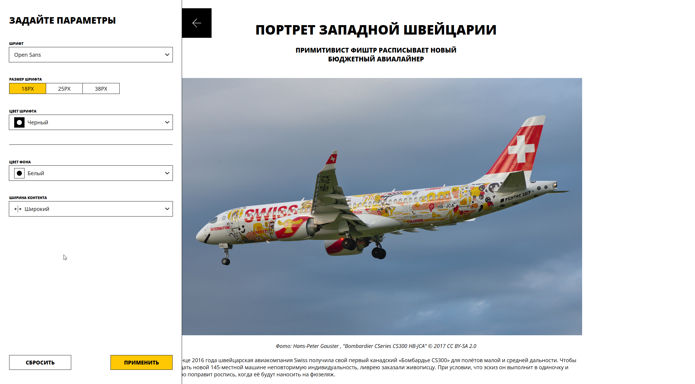

# Блог с настройками стилей

React-приложение для настройки внешнего вида статьи через панель управления с использованием CSS-переменных.



## 🚀 Функциональность

### Основные возможности

- **Панель настроек** в сайдбаре с 5 параметрами:

  - Шрифт (5 вариантов)
  - Размер шрифта (3 варианта)
  - Цвет текста (9 вариантов)
  - Цвет фона (9 вариантов)
  - Ширина контента (2 варианта)

- **Интерактивные элементы**:
  - Открытие/закрытие сайдбара по клику на стрелку
  - Закрытие панели по клику вне её области
  - Кнопки "Применить" и "Сбросить"

### Особенности реализации

- Изменения в форме не применяются сразу (соответствие ТЗ)
- Стили применяются только после нажатия "Применить"
- Возврат к дефолтным настройкам по кнопке "Сбросить"
- Динамическое обновление CSS-переменных

## 🛠 Технологии

- **React** с TypeScript
- **CSS Modules** для изоляции стилей
- **CSS Custom Properties** (переменные) для динамических стилей
- **Storybook** для UI-компонентов
- **Webpack** для сборки

## 🎨 Архитектура

### Состояние приложения

Приложение использует **два уровня состояния**:

1. **Глобальное состояние** (`articleState` в `index.tsx`)

   - Хранит примененные настройки статьи
   - Управляет CSS-переменными
   - Меняется только по кнопкам "Применить"/"Сбросить"

2. **Локальное состояние формы** (`formState` в `ArticleParamsForm.tsx`)
   - Хранит временные изменения в форме
   - Не влияет на статью до нажатия "Применить"
   - Сбрасывается при открытии формы

### Поток данных

Пользователь → Form → (formState) → "Применить" → App → (articleState) → CSS-переменные → Статья

### CSS-переменные

Стилизация реализована через CSS Custom Properties:

```css
.article {
  font-family: var(--font-family);
  font-size: var(--font-size);
  color: var(--font-color);
  max-width: var(--container-width);
  background-color: var(--bg-color);
}
🚀 Установка и запуск
---------------------

### Предварительные требования

-   Node.js 16+

-   npm или yarn

### Установка

bash

# Клонирование репозитория
git clone <repository-url>
cd <project-directory>

# Установка зависимостей
npm install

### Запуск в development режиме

# Запуск приложения
npm start

# Открыть Storybook для просмотра UI-компонентов
npm run storybook

### Сборка для production

npm run build

📖 Использование
----------------

1.  Откройте приложение в браузере

2.  Нажмите на стрелку в левом верхнем углу для открытия панели настроек

3.  Измените параметры в форме:

    -   Выберите шрифт из выпадающего списка

    -   Укажите размер шрифта через радиокнопки

    -   Выберите цвет текста и фона

    -   Настройте ширину контента

4.  Нажмите "Применить" для применения стилей к статье

5.  Используйте "Сбросить" для возврата к исходным настройкам

🧪 Тестирование
---------------

### Проверка функциональности

-   Открытие/закрытие сайдбара

-   Изменения не применяются без кнопки "Применить"

-   Корректное применение стилей

-   Сброс к дефолтным настройкам

-   Закрытие по клику вне панели

### Соответствие ТЗ

Все требования выполнены:

-   ✅ Панель открывается/закрывается по клику на стрелку

-   ✅ Панель закрывается по клику вне её области

-   ✅ Изменения в форме не применяются сразу

-   ✅ Стили применяются после нажатия "Применить"

-   ✅ "Сбросить" возвращает дефолтные настройки

-   ✅ Используются CSS-переменные из App компонента

🔧 Кастомные хуки
-----------------

### `useClickOutside`

Хук для обработки кликов вне элемента:

typescript

const useClickOutside = (
  ref: React.RefObject<HTMLElement>,
  callback: () => void
) => {
  // Реализация
};

Используется для закрытия панели настроек при клике вне её области.

👥 Разработка
-------------

### Правила коммитов

-   `feat:` Новая функциональность

-   `fix:` Исправление ошибок

-   `refactor:` Рефакторинг кода

-   `docs:` Обновление документации

-   `style:` Изменения в форматировании

### Ветвление

-   `main` --- стабильная версия

-   `review` --- ветка для разработки и code review
```
